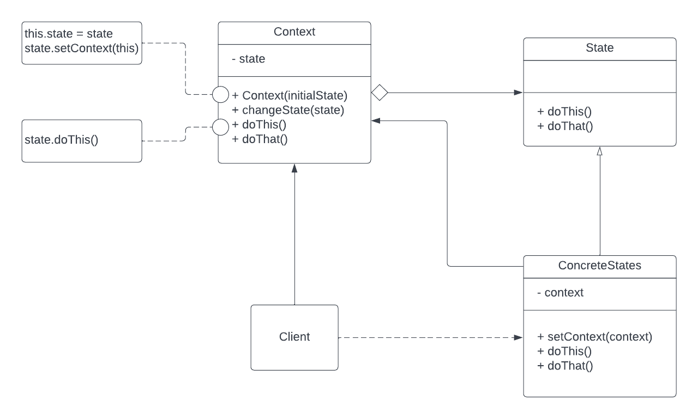

# State Pattern
State is a behavioral design pattern that lets an object alter its behavior when its internal state changes. It appears as if the object changed its class.

The State pattern is closely related to the concept of a Finite-State Machine

### UML Diagram
